  

  
  
  
  

  I build <strong>explainable ML systems</strong> and <strong>full-stack products</strong> with clear technical boundaries, inspectable decisions, and interfaces people can actually use.

## 👋 About

<table>
<tr>
<td width="50%" valign="top">

### What I build

- 🤖 ML-backed products with visible uncertainty and decision logic
- ⚙️ APIs and backend systems with **FastAPI / Node.js**
- 🖥️ Product interfaces with **React / Next.js / TypeScript**
- 📊 Data workflows designed to be testable, explainable, and reproducible

</td>
<td width="50%" valign="top">

### Current direction

- 🔭 Building machine-learning systems and full-stack products
- 🔬 Exploring explainable AI, robustness, and responsible model interpretation
- 🎓 B.Tech CSE · Chandigarh University · 2023–2027
- 🤝 Open to thoughtful engineering and ML collaborations

</td>
</tr>
</table>

## 🚀 Selected work

<table>
<tr>
<td width="33%" valign="top">

<h3>SentinelFlow</h3>

Synthetic-data fraud-risk reference workflow that keeps modelling, policy routing, and review surfaces inspectable.

<code>FastAPI</code> <code>Next.js</code> <code>Redis</code> <code>PostgreSQL</code> <code>MLflow</code>

<a href="https://sentinalflow.vercel.app">Live demo ↗</a> ·
<a href="https://github.com/snehOP9/Sentinal-Flow">Source ↗</a> ·
<a href="https://snehraunak.in/projects/sentinelflow/">Case study ↗</a>

</td>
<td width="33%" valign="top">

<h3>Student Performance Predictor Pro</h3>

Authenticated ML application connecting prediction, uncertainty, recommendations, and a focused web workflow.

<code>Python</code> <code>FastAPI</code> <code>React</code> <code>TypeScript</code> <code>Vite</code>

<a href="https://student-performance-predictor-pro-w.vercel.app/">Live demo ↗</a> ·
<a href="https://github.com/snehOP9/student-performance-api">Source ↗</a> ·
<a href="https://snehraunak.in/projects/student-performance-predictor/">Case study ↗</a>

</td>
<td width="33%" valign="top">

<h3>Anony Talk</h3>

Anonymous community product with peer interaction, account security, and clear non-clinical product boundaries.

<code>React</code> <code>Vite</code> <code>Node.js</code> <code>Express</code> <code>SQLite</code>

<a href="https://anony-talk-safespace.vercel.app/">Live demo ↗</a> ·
<a href="https://github.com/snehOP9/anony-talk">Source ↗</a> ·
<a href="https://snehraunak.in/projects/anony-talk/">Case study ↗</a>

</td>
</tr>
</table>

  <a href="https://snehraunak.in/#work"><strong>Explore all selected work on my portfolio →</strong></a>

## 🔬 Research / Explainable AI

### Explainable Machine Learning for Predicting Problematic Short-Form Video Use Among University Students

A research exploration focused on making model comparison and feature analysis inspectable and challengeable. The current work uses **synthetic student data** and includes model comparison, threshold selection, SHAP/LIME interpretation, robustness checks, and fairness-oriented analysis.

  
  

## 🧰 Core stack

  
   
  

  <strong>ML / systems:</strong> Python · FastAPI · scikit-learn · MLflow &nbsp; | &nbsp;
  <strong>Product:</strong> React · Next.js · TypeScript · Node.js &nbsp; | &nbsp;
  <strong>Data:</strong> PostgreSQL · Redis · SQLite

## 📡 Engineering pulse

  

<table>
<tr>
<td width="50%" align="center" valign="top">

</td>
<td width="50%" align="center" valign="top">

</td>
</tr>
</table>

## 🐍 Contribution activity

  <picture>
    <source media="(prefers-color-scheme: dark)" srcset="https://raw.githubusercontent.com/snehOP9/snehOP9/gh-pages/github-contribution-grid-snake-dark.svg">
    <source media="(prefers-color-scheme: light)" srcset="https://raw.githubusercontent.com/snehOP9/snehOP9/gh-pages/github-contribution-grid-snake.svg">
    
  </picture>

  Contribution visuals and dashboard metrics refresh automatically every day with GitHub Actions.

## 🌐 Find me around the web

  
  
  
  

  <strong>Build clearly. Explain honestly. Ship things that are useful.</strong>

